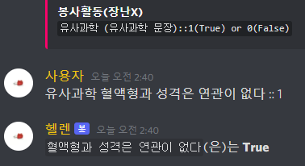

# similar_science

## 데이터 수집 동기
> 어느날 우연히 YouTube에서 「[유사과학 들으면 토하는 로봇](https://youtu.be/URaLCCtM1WQ)」이라는 주제로 한 프로젝트를 발견하였다.
> 
> 이 영상을 보고 더 정교하게 유사과학을 걸러낼 수 있다면 어떨까 생각하였다.

## 고민
> 데이터를 수집하기 전 크게 두가지 경우를 두고 고민했다.
> 1. 단순히 True와 False로 나눈다.
> 2. [유사과학 문장]과 [과학적 근거가 있는 문장]이 한 쌍이 되도록 한다.
> 
> 처음에는 2번의 형태로 데이터를 수집하고자 했지만 위의 영상의 프로젝트에는 유사과학인가 아닌가를 나누는 방식(이진분류)이 더 어울린다고 생각했다.
> 최대한 위 프로젝트와 어울리고 더 수집하기 쉽도록 1번 형태로 데이터를 수집하기로 결정했다.

## 데이터 형태
> 데이터는 간단하게 text와 label로 이루어진다.
> - text : 유사과학 혹은 과학적 근거가 있는 뮨장
> - label : text가 과학적 근거가 있을 경우 1, text가 과학적 근거가 없는 유사과학일경우 0

## 수집 방법
> 번거롭고 오래걸리지만 제일 확실한 방법인 수동 입력을 사용했다.
> 하지만 혼자서 파일에 하나하나 치는건 쉽지 않다는걸 알기 때문에 고민을 하다가 지인들의 힘을 빌리고자 했다.
> 내가 생각해낸 방법은 취미로 만든 Discord Bot인 Helen Bot에 '유사과학'이라는 기능을 추가하는 것이었다.
> 조금 조잡하게 만들어졌지만 참여하는 사람만 많다면 생각보다 효율적일지도 모른다.
> 
